# Ahmed Bluff Body OpenFOAM Validation Study: Mesh and Reynolds Number Sensitivity Studies

**Caesar Wiratama, M.S.¹,ᵃ⁾**

¹ PT Tensor Karya Nusantara  
ᵃ⁾ wiratama@pt-tensor.com

## Abstract

This report documents an OpenFOAM validation of the classic Ahmed bluff body at 25° slant angle. A production baseline (CFD) was established at \(U_\infty = 40\,\mathrm{m/s}\), followed by a three-level grid-independence study (GIT) and a three-point Reynolds-number sensitivity analysis. Force coefficients \(C_d\) and \(C_l\) are compared with experimental targets (\(C_d = 0.299\), \(C_l = 0.345\) at \(\mathrm{Re}_L = 2.78\times10^6\)). The medium mesh (~0.70 M cells) yields \(C_d\) and \(C_l\) errors within about 1% and 2% of experiment, respectively. The fine mesh shows incomplete steady convergence of \(C_l\). Reynolds-number sweeps on the medium mesh recover the expected mild decrease of \(C_d\) with Re.

Primary literature archived in `References/` for this study: Ahmed et al. [1], Lienhart et al. [2], and Meile et al. [3].

## 1. Introduction

The Ahmed body [1] is a simplified geometric vehicle model widely recognized as a benchmark in automotive aerodynamics for replicating the airflow characteristics of real passenger cars. Developed by S. R. Ahmed, G. Ramm, and G. Faltin in 1984, this generic bluff body features a sharp, slanted rear end that triggers complex three-dimensional flow structures, including massive flow separation and highly sensitive trailing vortices. Near a slant angle of about 30°, the wake topology changes abruptly; the 25° and 35° configurations bracket that critical regime [1, 2].

Validating an OpenFOAM template for this case is important because it forms a foundational element of tensorCFD [4], an open-source initiative by PT Tensor aimed at delivering production-ready, industry-grade simulation templates. This validated setup is intended as a core engine for tensorXFV, a template for external flow over road vehicles. Because the 25° slant sits near the critical aerodynamic threshold, verifying the template against trusted experiments—force coefficients from Meile et al. [3] and detailed wake/LDA structure from Lienhart et al. [2]—supports a reliable, mesh-aware, and Reynolds-number-aware baseline for automotive CFD development.

## 2. Numerical Methods

### 2.1 Solver and Turbulence Model

Incompressible steady RANS was solved with `simpleFoam` using the consistent SIMPLE algorithm. Turbulence closure is `kOmegaSST`. Kinematic viscosity is \(\nu = 1.5\times10^{-5}\,\mathrm{m}^2/\mathrm{s}\). Force coefficients use \(A_\mathrm{ref} = 0.115032\,\mathrm{m}^2\), \(\ell_\mathrm{ref} = 0.470\,\mathrm{m}\), and freestream density \(\rho_\infty = 1\) (incompressible convention).

### 2.2 Geometry and Boundary Conditions

The 25° Ahmed body STL occupies a domain \(x \in [-5, 15]\), \(y \in [-4, 4]\), \(z \in [0, 8]\,\mathrm{m}\). Inlet velocity is uniform \(U_\infty\); outlet pressure is fixed; the lower wall is a moving ground at freestream speed; upper and side walls are slip; the body is no-slip. Inlet turbulence intensity is about 1%, with \(k \propto U_\infty^2\) and \(\omega \propto U_\infty\) when Re is varied.

### 2.3 Mesh Generation

Background grids are generated with `blockMesh` and body-fitted hex-dominant meshes with `snappyHexMesh` (castellate, snap, layers). Feature edges are extracted with `surfaceFeatureExtract`. Parallel meshing uses eight ranks (hierarchical \(4\times2\times1\)). The baseline (`mesh02` / CFD) has approximately 695,463 cells after layer addition.

**Table 1.** Baseline numerical setup

| Item | Setting |
| --- | --- |
| OpenFOAM | v2406 / run host v2512 |
| Solver | `simpleFoam` (steady RANS) |
| Turbulence | RAS `kOmegaSST` |
| \(U_\infty\) (baseline) | 40 m/s |
| \(\mathrm{Re}_L = U_\infty L / \nu\), \(L = 1.044\,\mathrm{m}\) | \(2.78\times10^6\) |
| \(\nu\) | \(1.5\times10^{-5}\,\mathrm{m}^2/\mathrm{s}\) |
| Exp. \(C_d\) / \(C_l\) (\(\mathrm{Re}_L = 2.78\times10^6\)) [3] | 0.299 / 0.345 |
| Decomposition | 8 ranks, hierarchical (4 2 1) |
| End time (iterations) | 500 |

## 3. Baseline CFD Results

The production baseline at \(U_\infty = 40\,\mathrm{m/s}\) on the medium mesh converges to \(C_d \approx 0.2971\) and \(C_l \approx 0.3381\) (mean of the last 200 iterations), corresponding to relative errors of about −0.65% and −2.0% versus the Meile / TU Graz experimental anchors [3]. The freestream speed matches the Lienhart LDA campaign [2], which characterises the 25° attached-slant / C-pillar vortex wake used as the flow-physics reference for this geometry.

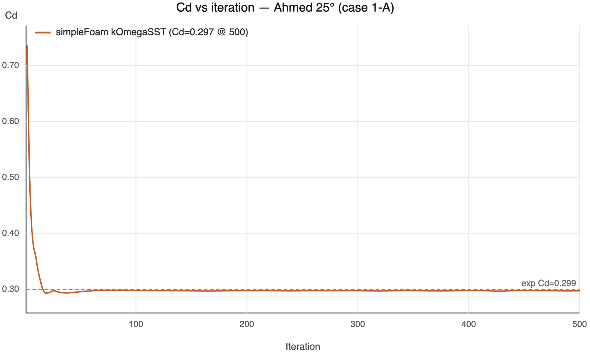

**Figure 1.** Baseline CFD: \(C_d\) versus iteration (\(U_\infty = 40\,\mathrm{m/s}\)).

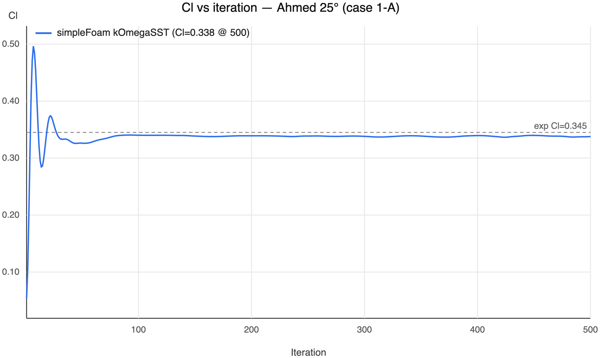

**Figure 2.** Baseline CFD: \(C_l\) versus iteration (\(U_\infty = 40\,\mathrm{m/s}\)).

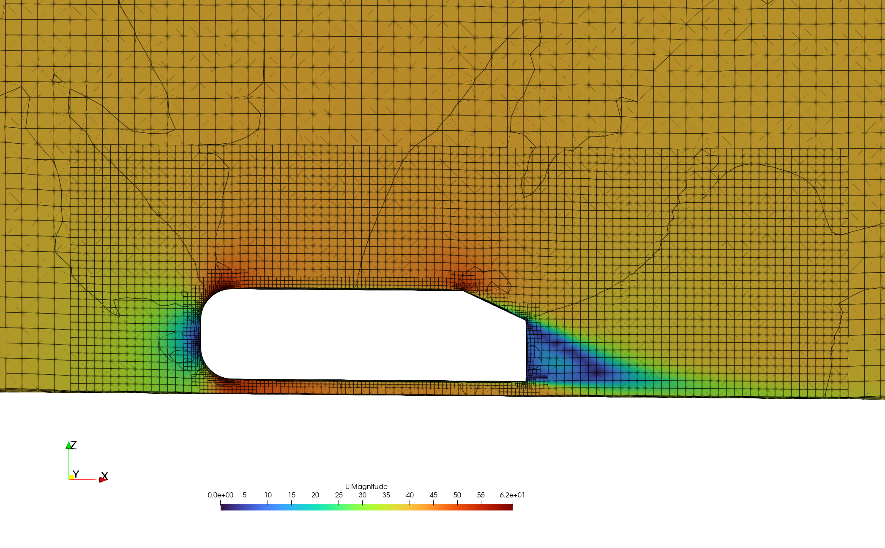

**Figure 3.** Baseline velocity magnitude on the symmetry plane (`mesh02` / CFD, \(U_\infty = 40\,\mathrm{m/s}\)).

## 4. Grid Independence Study (GIT)

Three meshes were constructed by changing background resolution, surface/feature refinement, volume boxes, and prism layers. Physics and boundary conditions match the CFD baseline. `mesh02_medium` is identical in intent to CFD (~0.70 M cells). Experimental targets remain \(C_d = 0.299\) and \(C_l = 0.345\) [3].

**Table 2.** Mesh ladder settings

| Case | blockMesh | Surface level | Volume boxes | Body layers | Cells |
| --- | --- | --- | --- | --- | --- |
| `mesh01_coarse` | (16 8 8) | (4 5) | 2 / 3 / 4 | 6 | 40,086 |
| `mesh02_medium` | (24 10 10) | (5 6) | 3 / 4 / 5 | 10 | 695,463 |
| `mesh03_fine` | (36 14 14) | (6 7) | 4 / 5 / 6 | 12 | 6,459,285 |

**Table 3.** GIT results versus experiment (mean of last 200 iterations; averaging accommodates residual transient content)

| Mesh | Cells | \(C_d\) | \(C_d\) err % | \(C_l\) | \(C_l\) err % |
| --- | ---: | ---: | ---: | ---: | ---: |
| `mesh01_coarse` | 40,086 | 0.3854 | +28.90% | 0.3737 | +8.33% |
| `mesh02_medium` | 695,463 | 0.2971 | −0.65% | 0.3381 | −1.99% |
| `mesh03_fine` | 6,459,285 | 0.2884 | −3.54% | 0.3124 | −9.46% |

The coarse mesh over-predicts drag substantially. The medium mesh is closest to experiment [3]. The fine mesh does not improve \(C_l\) agreement: \(C_l\) exhibits a large limit-cycle oscillation in the last 100 iterations (range ≈ 0.16), so the steady RANS mean is not a fully converged steady answer. Finer grids reduce numerical dissipation and expose the intrinsic unsteadiness of the 25° Ahmed wake—consistent with the complex, vortex-dominated near-wake documented experimentally for this slant [1, 2].

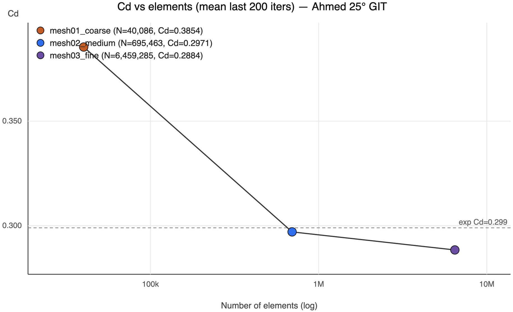

**Figure 4.** \(C_d\) versus number of elements (GIT), with experimental \(C_d = 0.299\) [3].

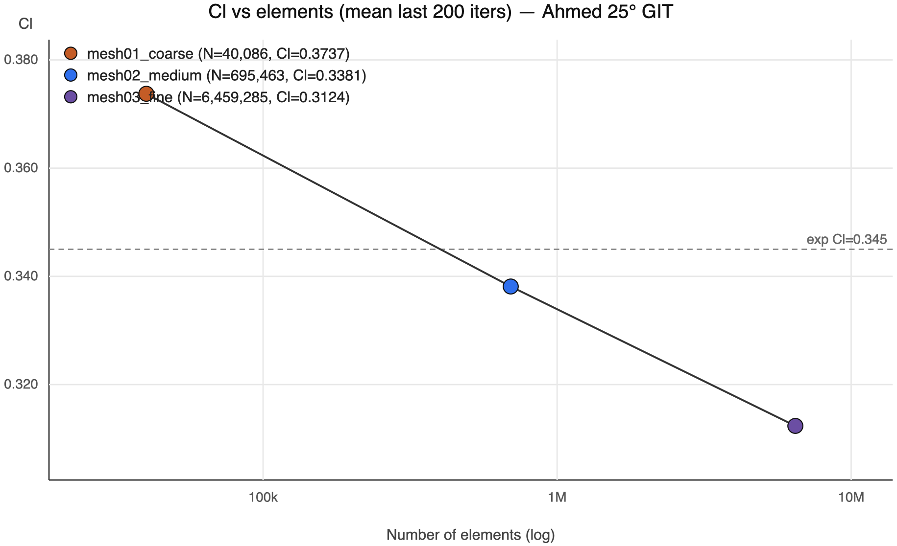

**Figure 5.** \(C_l\) versus number of elements (GIT), with experimental \(C_l = 0.345\) [3].

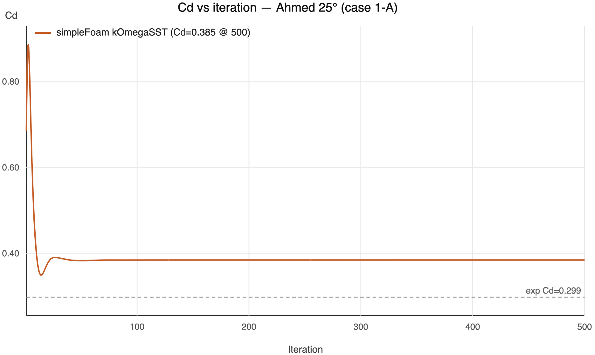

**Figure 6.** `mesh01_coarse`: \(C_d\) versus iteration.

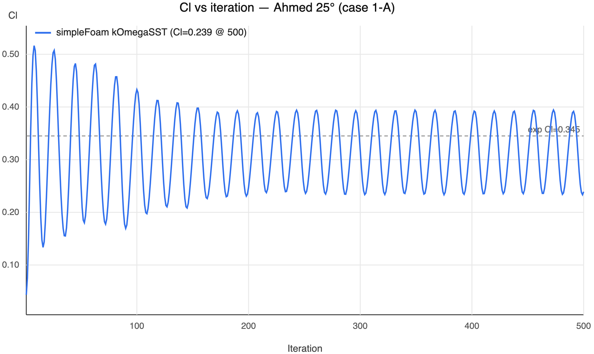

**Figure 7.** `mesh03_fine`: \(C_l\) versus iteration (strong late-time oscillation).

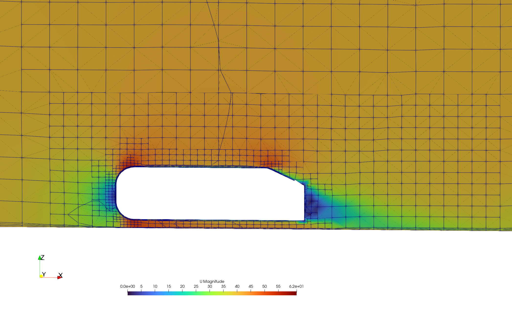

**Figure 8.** Velocity magnitude, `mesh01_coarse` (symmetry plane).

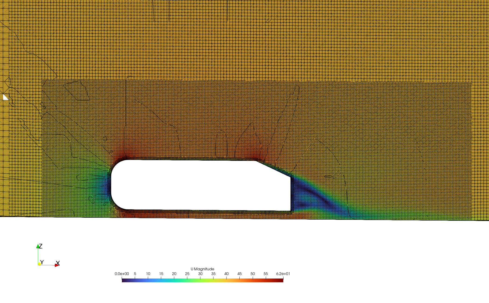

**Figure 9.** Velocity magnitude, `mesh03_fine` (symmetry plane).

## 5. Reynolds Number Sensitivity

Using the medium mesh, freestream speed was set to 20, 40, and 60 m/s (\(\mathrm{Re}_L \approx 1.39\times10^6\), \(2.78\times10^6\), \(4.18\times10^6\)). Turbulence intensity and length scale were held fixed by scaling \(k \propto U_\infty^2\) and \(\omega \propto U_\infty\).

Mid-Re experimental anchors (\(C_d = 0.299\), \(C_l = 0.345\)) are taken from the TU Graz force measurements reported by Meile et al. [3]. Low- and high-Re \(C_{d,\mathrm{exp}}\) values used in Table 4 are **trend estimates** for context only: Meile et al. [3] report roughly a 13% change in \(C_d\) over \(0.7\times10^6 \le \mathrm{Re} \le 2.7\times10^6\) and compare their data with Ahmed et al. [1] at \(\mathrm{Re} = 4.29\times10^6\), where the Re dependence of \(C_d\) is weaker. Those trends were used to place low/high \(C_{d,\mathrm{exp}}\) while keeping the mid-Re point fixed at 0.299 [3]. \(C_{l,\mathrm{exp}}\) is held at 0.345 (weak Re dependence for 25° in [3]).

**Table 4.** Re sensitivity: CFD versus experiment (mean of last 200 iterations)

| Case | \(U_\infty\) | \(\mathrm{Re}_L\) | \(C_d\) | \(C_{d,\mathrm{exp}}\) | \(C_d\) err % | \(C_l\) | \(C_{l,\mathrm{exp}}\) | \(C_l\) err % |
| --- | ---: | ---: | ---: | ---: | ---: | ---: | ---: | ---: |
| `re01_U20` | 20 | \(1.39\times10^6\) | 0.3019 | 0.3190† | −5.36% | 0.3278 | 0.3450 | −4.98% |
| `re02_U40` | 40 | \(2.78\times10^6\) | 0.2971 | **0.2990** [3] | −0.65% | 0.3381 | **0.3450** [3] | −1.99% |
| `re03_U60` | 60 | \(4.18\times10^6\) | 0.2953 | 0.2970† | −0.56% | 0.3431 | 0.3450 | −0.56% |

† Trend estimate anchored to [3] (and the Ahmed Re comparison discussed therein [1]); not an independent wind-tunnel point at this exact \(\mathrm{Re}_L\).

CFD recovers a mild decrease of \(C_d\) with increasing Re, consistent with [1, 3]. Agreement is best at mid Re against the exact experimental anchors [3]. The larger low-Re \(C_d\) discrepancy partly reflects uncertainty in the estimated \(C_{d,\mathrm{exp}}\) at \(\mathrm{Re}_L = 1.39\times10^6\).

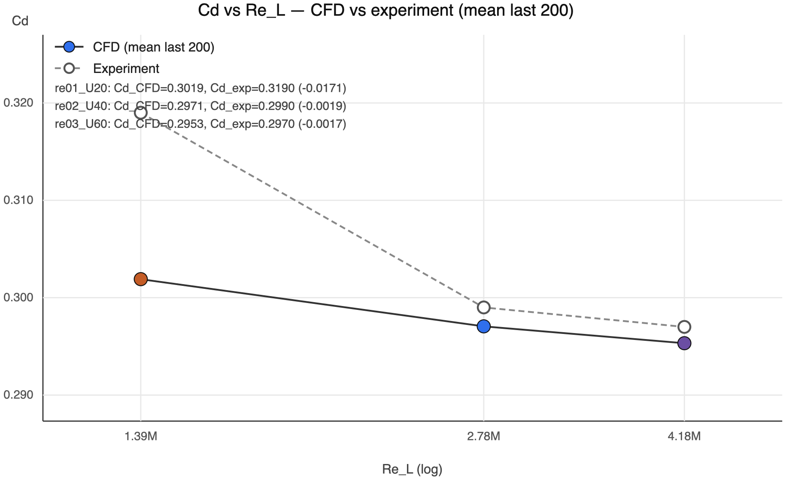

**Figure 10.** \(C_d\) versus \(\mathrm{Re}_L\): CFD versus experiment.

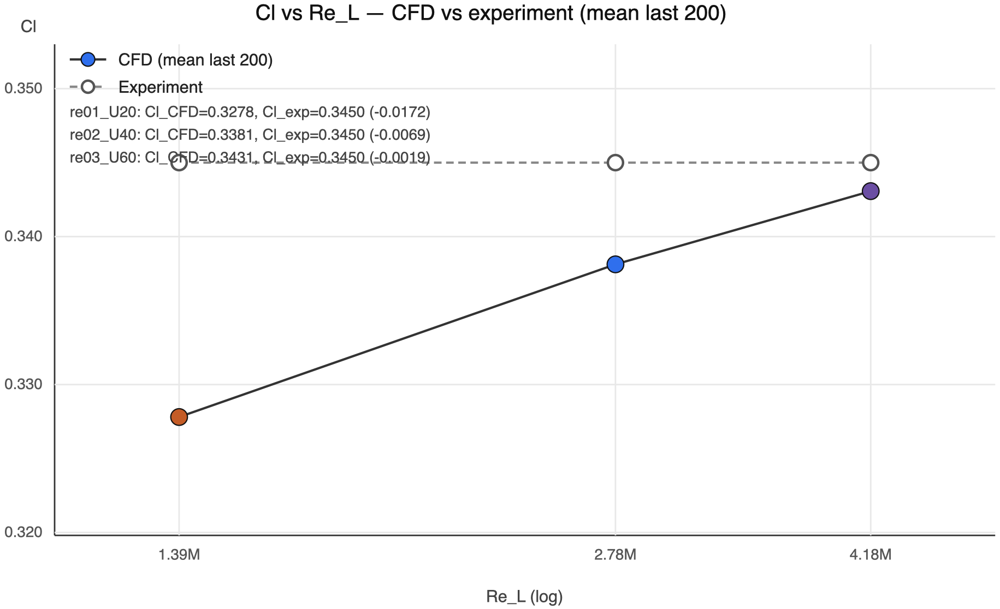

**Figure 11.** \(C_l\) versus \(\mathrm{Re}_L\): CFD versus experiment.

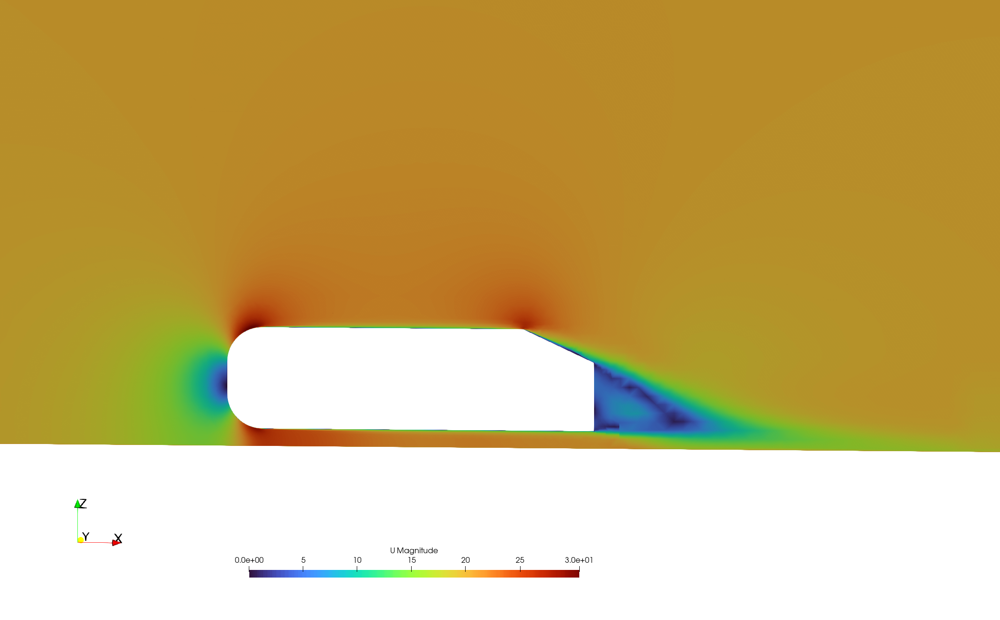

**Figure 12.** Velocity magnitude at \(U_\infty = 20\,\mathrm{m/s}\) (`re01_U20`).

**Figure 13.** Velocity magnitude at \(U_\infty = 40\,\mathrm{m/s}\) (`re02_U40`).

**Figure 14.** Velocity magnitude at \(U_\infty = 60\,\mathrm{m/s}\) (`re03_U60`).

## 6. Conclusions

This study established and validated an OpenFOAM v2406 RANS workflow for the 25° Ahmed body against experimental force coefficients at \(U_\infty = 40\,\mathrm{m/s}\) [3]. Through a systematic grid-independence study, the medium mesh (~0.70 M cells) was identified as the practical optimum for steady RANS, with \(C_d\) error ≈ −0.65% and \(C_l\) error ≈ −2% versus [3].

Increasing resolution to ~6.5 M cells did not improve \(C_l\); instead it exposed wake unsteadiness incompatible with a steady iteration average, in line with the sensitive 25° wake topology described by Ahmed et al. [1] and Lienhart et al. [2]. Fair assessment of such fine meshes would require URANS or DES with longer time averaging. Reynolds-number sweeps on the medium mesh recovered a physically consistent \(C_d(\mathrm{Re})\) trend relative to Meile et al. [3] and Ahmed et al. [1], remaining within a few percent of the mid-Re experimental anchors.

## Acknowledgement

Thanks to PT Tensor for sponsoring this validation study and for advancing the CFD community through the tensorCFD initiative [4]. This work reflects their aim of keeping high-fidelity engineering templates accessible, practical, and production-ready.

In the spirit of open-source collaboration, the case files, mesh configurations, and post-processing scripts are publicly available at <https://github.com/pt-tensor/AhmedBody-RANS.git>.

## References

Sources [1]–[3] correspond to the papers archived under `References/` (markdown notes + PDFs). Source [4] is the project website (not a journal paper).

1. Ahmed, S. R., Ramm, G., & Faltin, G. (1984). *Some Salient Features of the Time-Averaged Ground Vehicle Wake*. SAE Technical Paper 840300.  
   → `References/some-salient-features-of-the-time-averaged-ground-vehicle-wake.md`

2. Lienhart, H., Stoots, C., & Becker, S. (2000). *Flow and Turbulence Structures in the Wake of a Simplified Car Model (Ahmed Model)*. DGLR Fach-Symposium der AG STAB, Universität Stuttgart, 15–17 November 2000.  
   → `References/flow-and-turbulence-structures-in-the-wake-of-a-simplified-car-model-ahmed-model.md`

3. Meile, W., Brenn, G., Reppenhagen, A., Lechner, B., & Fuchs, A. (2011). *Experiments and numerical simulations on the aerodynamics of the Ahmed body*. *CFD Letters*, 3(1), 32–39.  
   → `References/experiments-and-numerical-simulations-on-the-aerodynamics-of-the-ahmed-body.md`

4. PT Tensor. OpenFOAM case templates / tensorCFD. <https://en.pt-tensor.com/openfoam-case-templates/>
